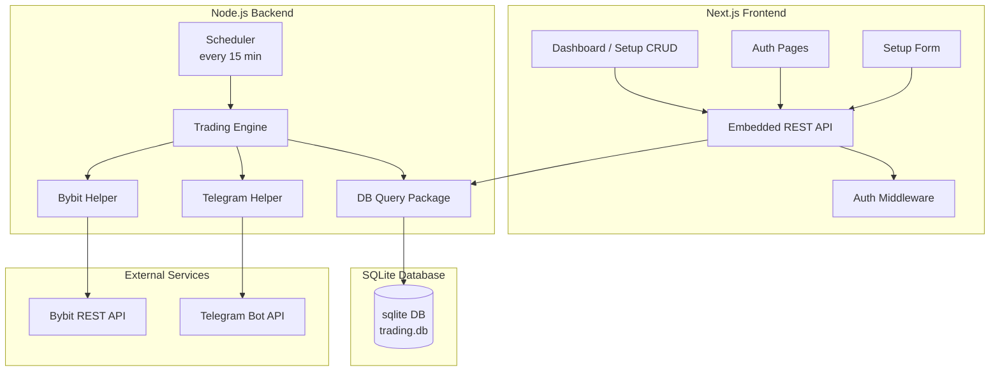
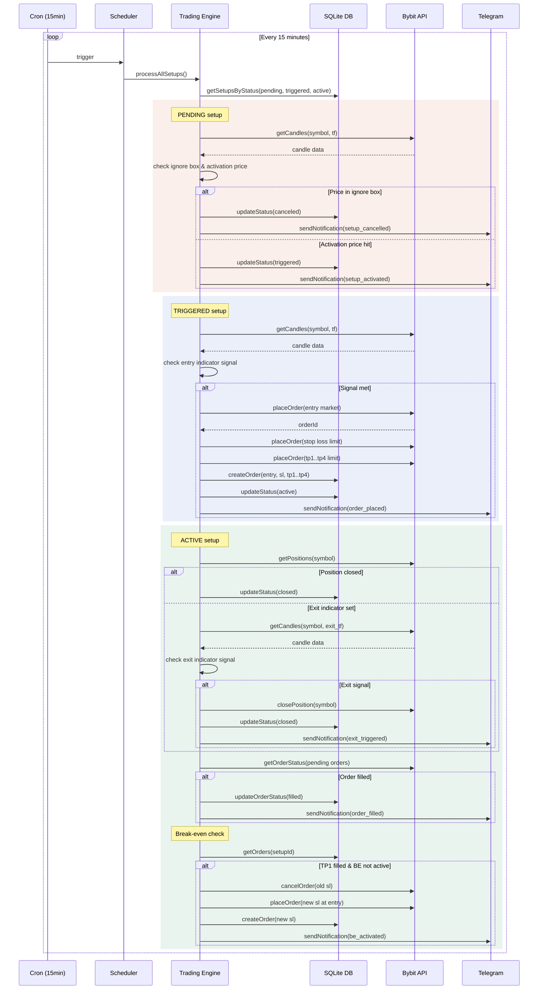

# OmniTrader

Automated crypto trading system for Bybit with a Next.js UI and Node.js trading engine.

## Architecture

```
omnitrader/
├── db/                    # Shared SQLite database
├── src/
│   ├── ui/                # Next.js web dashboard (port 3000)
│   └── engine/            # Trading engine (port 3001)
├── docker-compose.yml     # Docker deployment
├── .env.example           # Shared env reference
└── logs/                  # Engine logs
```

- **UI**: Next.js dashboard for managing accounts, trading setups, and viewing orders
- **Engine**: Node.js scheduler that runs on a 15-minute cron, monitors indicators, and executes trades

### Component View



| Component | Responsibility |
|-----------|----------------|
| **Next.js Frontend** | Login, setup CRUD (Pending/Active/Closed tabs), memo/notes |
| **REST API** | Serve UI, validate requests, orchestrate helpers |
| **Auth Middleware** | Token/session validation for protected endpoints |
| **DB Query Package** | All SQLite reads/writes for users, accounts, setups, orders |
| **Scheduler** | Wake every 15 min, select due setups, feed to Trading Engine |
| **Trading Engine** | Core orchestration: check activation, ignore box, entry signal, then place TP/SL |
| **Bybit Helper** | Fetch prices, submit orders, query order status |
| **Telegram Helper** | Send real-time alerts to user chat |

### Engine Sequence



## Quick Start (Local)

### Prerequisites
- Node.js 18+
- NPM

### 1. Clone & Install

```bash
git clone <repo> omnitrader
cd omnitrader

# Install UI dependencies
cd src/ui && npm install && cd ../..

# Install Engine dependencies
cd src/engine && npm install && cd ../..
```

### 2. Configure Environment

```bash
# UI
cp src/ui/.env.example src/ui/.env
# Edit JWT_SECRET, ENCRYPTION_KEY - DATABASE_PATH is relative

# Engine
cp src/engine/.env.example src/engine/.env
# Edit ENCRYPTION_KEY, TELEGRAM_BOT_TOKEN, etc.
```

Database path uses a relative path `db/trading.db` (relative to project root).

### 3. Run

**Terminal 1 - UI:**
```bash
cd src/ui
npm run build && npm start
# Opens at http://localhost:3000
```

**Terminal 2 - Engine:**
```bash
cd src/engine
npm start
# Health server at http://localhost:3001
```

## Docker (VPS Deployment)

```bash
docker compose up -d --build
```

This starts:
- **UI** on port 3000
- **Engine** on port 3001

Both share the `./db` volume for the SQLite database.

### Environment

Each service reads its own `.env` file. The `DATABASE_PATH` environment variable should be relative (e.g., `db/trading.db`), resolved against the project root.

## Database

The UI and Engine share a single SQLite database at `db/trading.db`. The path is configured via the `DATABASE_PATH` env variable. When set as a relative path, both services resolve it relative to the project root (`omnitrader/`).

## Services

| Service | Port | Description |
|---------|------|-------------|
| UI      | 3000 | Web dashboard |
| Engine  | 3001 | Trading engine + health server |

## Environment Files

Each service has its own environment file:

| Service | File | Key Variables |
|---------|------|---------------|
| **UI** | `src/ui/.env` | `JWT_SECRET`, `ENCRYPTION_KEY`, `DATABASE_PATH` |
| **Engine** | `src/engine/.env` | `ENCRYPTION_KEY`, `DATABASE_PATH`, `TELEGRAM_BOT_TOKEN`, `BYBIT_API_*`, `SCHEDULE_PATTERN`, `LOG_*` |

> **Note**: Telegram User ID is now configured per-user in the UI Settings page, not in the engine `.env` file. If `TELEGRAM_USER_ID` is still set in the engine `.env`, it will be used as a fallback. Set it via **Settings → Telegram** in the dashboard for proper per-user notifications.

Reference copies with all available variables are at `src/ui/.env.example` and `src/engine/.env.example`.

The `DATABASE_PATH` defaults to `db/trading.db` (relative to the project root) and must match across both services.