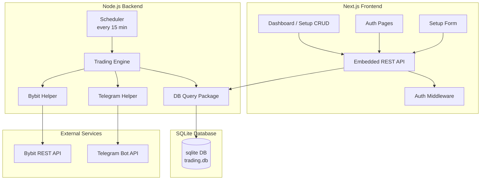
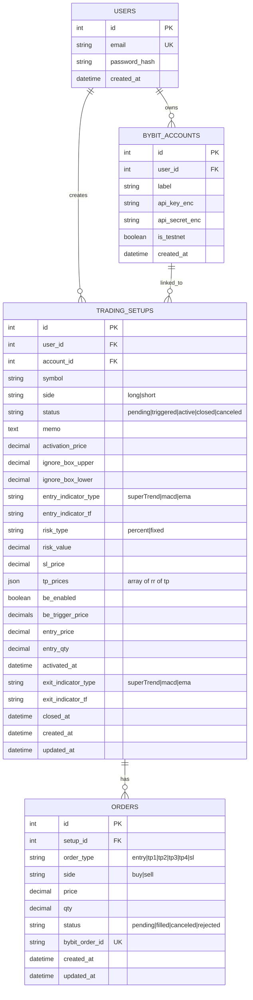

# MVP: Bybit Trading Automation — Architecture & Orchestration

## 1. System Overview

A lightweight algorithmic trading MVP that monitors Bybit price data, validates entry conditions based on technical indicators, executes orders, assigns native TP/SL, and sends Telegram alerts. Once a trade is placed, the system does not continuously monitor that position.

- **Frontend**: Next.js dashboard (Setup CRUD, auth, UI)
- **Backend**: Node.js REST API + Scheduler (15-min polling)
- **Database**: SQLite (single-file, zero-config)
- **External**: Bybit REST API, Telegram Bot API

---

## 2. Component View

### Component Responsibilities

| Component | Responsibility |
|-----------|----------------|
| **Next.js Frontend** | Login, setup CRUD (Pending/Active/Closed tabs), memo/notes, Telegram chat ID config |
| **REST API** | Serve UI, validate requests, orchestrate helpers |
| **Auth Middleware** | Token/session validation for protected endpoints |
| **DB Query Package** | All SQLite reads/writes for users, accounts, setups, orders |
| **Scheduler** | Wake every 15 min, select due setups, feed to Trading Engine |
| **Trading Engine** | Core orchestration: check activation, ignore box, entry signal, then place TP/SL |
| **Bybit Helper** | Fetch prices, submit orders, query order status |
| **Telegram Helper** | Send real-time alerts to user chat |

---

## 3. Database Schema

### Schema Notes

- `api_key_enc` / `api_secret_enc`: store encrypted, never plaintext.
- `tp_levels`: JSON array of RR ratios (e.g., `[1,2,3,4]`).
- `tp_prices`: JSON array of computed limit prices for each TP.
- `status`: lifecycle is **pending → triggered->active → closed** or **pending → canceled**.
if price hit active price , the status will be triggered.

