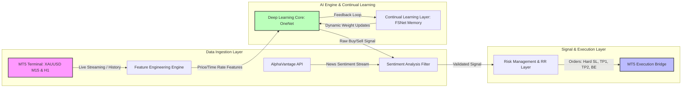

# AI Engine for XAU/USD Trading

## 1. Executive Summary
Automated ML trading engine for XAU/USD using Wave corrections (M15) confirmed by H1 SuperTrend. OneNet/FSNet deep learning with continual learning, AlphaVantage sentiment filter, and MT5 execution. Targets: Monthly Return > 5%, MDD < 10%, validated over 5-year backtest.

## 2. System Architecture

## 3. Core Logic & AI Pipeline

### 3.1 Multi-Timeframe Strategy

* **Macro Filter (H1):** SuperTrend determines structural direction ($Price\ Rate = \Delta P/\Delta t$, $Time\ Rate = \Delta t$).
* **Execution Trigger (M15):** Tracks "Fast Motive Bars". Positions are initiated strictly upon the validated completion of an Elliott Wave corrective structure (e.g., Wave 2 or Wave 4 pullbacks) to capture impulsive waves.

### 3.2 Machine Learning & Sentiment Loop

* **Architecture:** **OneNet Framework** for stream processing paired with **FSNet (Fast/Slow Networks)** to allow continuous learning from streaming data without catastrophic forgetting.
* **Sentiment Filter:** Real-time NLP processing via `AlphaVantage`. Signals conflicting with the dominant sentiment (Positive/Negative/Neutral) are discarded.

---

## 4. Execution & Advanced Risk Management (RR-Based)

To achieve the targeted asymmetric risk profile, position management relies strictly on predefined Risk-to-Reward (RR) multiples rather than fixed pip metrics:

1. **Position Inception**: Trade executed via MT5 API. A server-side **Hard Stop Loss (SL)** is placed at the recent Elliott Wave structural invalidation point ($0.0\ R$). Total risk per trade is capped at 1% of equity.
2. **Take Profit 1 (1.5:1 RR)**: When price reaches a **1.5:1 Risk-to-Reward ratio**, 50% of the volume is closed. The remaining position's SL is automatically moved to **Break-Even (BE)** plus commissions.
3. **Take Profit 2 (3:1 RR) & Trailing**: When price reaches a **3:1 Risk-to-Reward ratio**, an additional 25% of the volume is scaled out. The final 25% activates a **Trailing Stop** tied to the M15 structural swings to capture extended macro moves.

---

## 5. System Target Performance Metrics

The complete infrastructure will be benchmarked and rejected if it fails to meet the following parameters during validation:

* **Backtest Horizon:** 5 Years (2021 – 2026) historical walk-forward backtest.
* **Target Monthly Return:** $> 5\%$ net profit.
* **Risk Tolerance:** Maximum Peak-to-Trough Drawdown (**MDD**) $< 10\%$.
* **Data Quality:** 99% Tick Precision data including simulated slippage and dynamic spreads.

---

## 6. Project Budget & Phased Milestones

The total budget for this implementation is **$1,000 USD** mapped out across two target milestones to verify profitability before going into production:

### Milestone 1: Quantitative Strategy Validation & Backtest Report

* **Timeline:** 2 Weeks
* **Budget Allocation:** $600 USD
* **Deliverables:** * Fully built feature extraction engine (H1 SuperTrend + M15 EW Core Logic).
* Integration of the OneNet and FSNet continual learning frameworks.
* Definitive **5-Year Backtest Report** confirming whether the architecture meets the $>5\%$ monthly return and $<10\%$ MDD targets using high-precision tick data.

### Milestone 2: MT5 Bridge Integration & Guided Paper Trading

* **Timeline:** 3 Weeks
* **Budget Allocation:** $400 USD
* **Deliverables:**
* Integration of the AlphaVantage News Sentiment API gate filter.
* Execution layer coding for the MetaTrader 5 (MT5) python bridge.
* Implementation of the automated Risk-to-Reward rules (TP1/TP2, Break-Even modifications, Trailing Stops).
* **3-Week Active Paper Trading Phase:** Multi-week live forward-testing on an MT5 demo account. Collaborative monitoring to catch anomalies, analyze forward drawdowns, and fine-tune model parameters dynamically based on actual market live metrics.

---

## 7. Key Deliverables at Project Completion

1. **Backtest Logs:** A fully reproducible backtesting pipeline validating the 5-year track record.
2. **ML Engine Source Code:** Production-ready Python modules (`OneNet` + `FSNet` framework).
3. **Live MT5 Connector:** Operational execution engine managing the live trade matrix seamlessly on demo/forward environments.
